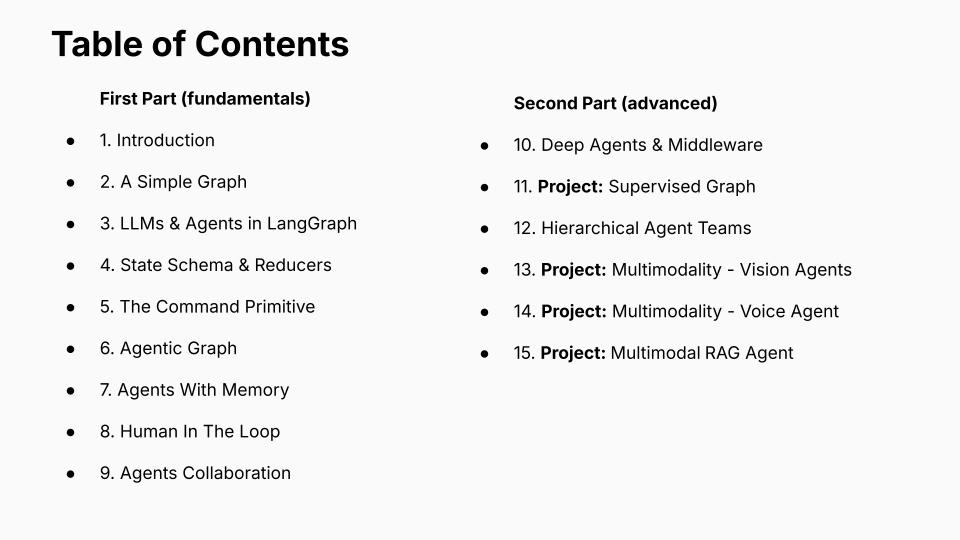
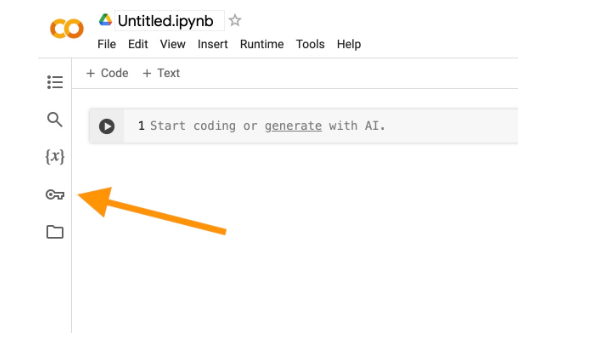

# Learning-LangGraph

An intermediate-level, comprehensive LangGraph course, focusing on practical use cases. 

## Structure

Find the slides for the course introduction at [`slides/`](./slides/LangGraph-Course.pdf)

The course is divided in two parts: the first part, until notebook #9, teaches you LangGraph / LangChain basics. The second part focuses on more advanced stuff, with some interesting real-use cases. 


    
</img>

The first part of the course uses mainly Jupyter notebooks that you can run locally or in Google Colab. 

The second part still has notebooks that reference the projects' highlights, while those projects are fully implemented in the [`projects/`](./projects/) folder. 

## Setup

**NOTE:** If your intention is to only work on Google Colab - at least for the first part of the course - you can skip the virtual environment creation and go straight to [setting up env variables](./README.md#setting-up-env-variables). 

Still, the creation of a local virtual environment will be needed later on.

### Python version

Make sure you're using Python version >= 3.11
```
python3 --version
```

### Clone repo
```
git clone https://github.com/MatteoFalcioni/Learning-LangGraph.git
$ cd Learning-LangGraph
```

### Create an environment and install dependencies

#### Mac/Linux/WSL with Anaconda (recommended)
```
$ conda create -n learning-langgraph python=3.11 -y
$ conda activate learning-langgraph
$ pip install -r requirements.txt
```

#### Mac/Linux/WSL (without Anaconda)
```
$ python3 -m venv lc-academy-env
$ source lc-academy-env/bin/activate
$ pip install -r requirements.txt
```

### Setting up env variables
Briefly going over how to set up environment variables. 

#### From shell
We can do it from shell (Mac/Linux/WSL):
```
$ export API_ENV_VAR="your-api-key-here"
```
#### From code

##### Google Colab 
In Google Colab, follow these steps:

1. Open your Google Colab notebook and click on the 🔑 Secrets tab in the left panel.
    
2. Create a new secret with the desired name - for example, `OPENAI_API_KEY`.
3. Copy and paste your API key into the `Value` input box of `OPENAI_API_KEY`.
4. Toggle the button on the left to allow all notebooks access to the secret. 

##### Jupyter Notebooks or Python files
If we are using a generic local notebook with Jupyter, or if we are working with `.py` files, I recommend writing a `.env` file at your project root. 

**This `.env` file must be added to your `.gitignore` file so that you do not accidentally commit your secrets to GitHub** 

The `.env` file must have a structure like this:
```bash
OPENAI_API_KEY=<your_key_here>
```

Then we can use the `load_dotenv()` function from the `dotenv` python package:

```python
from dotenv import load_dotenv()

load_dotenv()
```
This will automatically load the secrets into the environment. Now all stuff requiring the `OPENAI_API_KEY` (in our example) will work. 

Once loaded we can also directly access the keys as 
```python
import os

load_dotenv()
openai_api_key = os.environ['OPENAI_API_KEY']  # or os.getenv('OPENAI_API_KEY')
```

### Set OpenAI API key

We will be using LLMs APIs during the whole course. We advice you to subscribe to OpenAI in order to have the possibility to use their models in LangChain:

* If you don't have an OpenAI API key, you can sign up [here](https://openai.com/index/openai-api/).
* Set `OPENAI_API_KEY` in your environment 

### Sign up and Set LangSmith API

This is a must for debugging LangChain agents. You will not be able to debug without a LangSmith key.

* Sign up for LangSmith [here](https://docs.langchain.com/langsmith/create-account-api-key#create-an-account-and-api-key), find out more about LangSmith and how to use it within your workflow [here](https://www.langchain.com/langsmith). 
*  Set `LANGSMITH_API_KEY`, `LANGSMITH_TRACING_V2="true"` `LANGSMITH_PROJECT="langchain-academy"`in your environment 
*  If you are on the EU instance also set `LANGSMITH_ENDPOINT`="https://eu.api.smith.langchain.com" as well.

### Other API Keys

During the course, we will often suggest the use of other commonly used and very helpful apis, like `OpenRouter`, `Mistral OCR`, `DeepGram`, etc. These are not free. You can always avoid using these and switch to open source: we will always provide a free alternative.  

### Note on Open Source LLMs (free llms)

Why not use some of the latest free, open source large language models, instead of giving money to OpenAI? 

Well, the problem is usually compute power: these model are large - as their acronym suggets - and we are usually not able to run them locally. Still, if you have a strong enough machine (with a GPU) at your disposal, you can use [Ollama](https://ollama.com/) to use open source models. 

Check out LangChain's Ollama integration [here](https://docs.langchain.com/oss/python/integrations/providers/ollama#model-interfaces). I advice you to experiment during the course with some small local models to see the difference in the results. 

In order to swap the OpenAI models with local models pulled from Ollama, just pull a model from Ollama in your terminal:

```bash 
$ ollama pull gpt-oss:20b
```

install the `langchain-ollama` package:

```bash 
pip install -qU langchain-ollama
```

and then use `ChatOllama` from LangChain in your code:

```python
from langchain_ollama import ChatOllama

llm = ChatOllama(
    model="llama3.1",
    temperature=0,
    # other params...
)
```

> **Note:** With the constant advance of open source models, you will probably be able to achieve pretty good results with smaller, local models. Of course, if you need the best performance, you will need to use gigantic models (like Claude Opus 4.5, GPT 5, Gemini 3, Kimi K2, and so on).