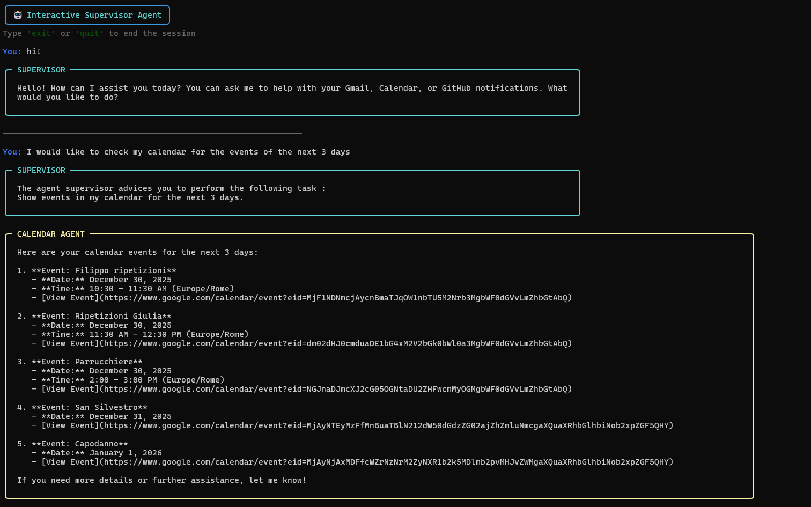

# Supervised Agent Workflow (Lecture 11)

In this project we will be creating a supervised agent workflow: a supervisor agent managing 3 subagents.

In our example our subagents will peform three distinct functions: 
- the `email_agent` will be checking incoming mails on our Gmail, writing drafts, requesting for approval or edits (HITL) and sanding emails if approved;
- the `calendar_agent` will check our Google Calendar, remind us of incoming events and writing new events if requested;
- the `github_agent` will check our `GitHub`notifications and, if we approve, dismiss them.

For details on MCP servers (used for the github agent) and handoff tools (used for the supervisor) refer to the [11_supervisor notebook](../../notebooks/11_supervisor.ipynb). 

<center>
    
</center>

Notice that to build this exact same project you will need google API keys and permissions and a GitHub token. Check the sections [google setup](#google-setup) and [github personal access token](#github-personal-access-token-for-mcp) to get them.

## Usage

After getting the credential files and tokens, fill the `.env.example` file with your keys and place the `credentials.json` and `token.json` files inside the `src/` directory.

Then enter the `src/` directory and run the main:
```bash
    python main.py
```

You will enter the interactive chat:

<center>
    
</center>

## Google Setup

To use the Gmail and Calendar tools, you need to set up a Google Cloud Project and generate local credentials.

### 1. Generate `credentials.json`

1. Go to the [Google Cloud Console](https://console.cloud.google.com/).
2. **Create a New Project** (or select an existing one).
3. **Enable APIs:** Search for and enable both the **Google Calendar API** and the **Gmail API**.
4. **Configure OAuth Consent Screen:**
* Set **User Type** to **External**.
* Add your email to the **Test Users** list (Required while in "Testing" mode).
* Add the scopes: `.../auth/calendar` and `.../auth/gmail.modify`.


5. **Create Credentials:**
* Go to **Credentials** > **Create Credentials** > **OAuth client ID**.
* Select **Desktop App** as the application type.
* Download the JSON file, rename it to `credentials.json`, and place it in your project root.

### 2. Generate `token.json`

The `token.json` file is generated automatically the first time you run the script:

1. **Delete any existing `token.json**` if you have changed your scopes or are getting "Insufficient Permission" errors.
2. Run your Python script.
3. A browser window will open asking you to log in to your Google account.
4. If you see a "Google hasn't verified this app" warning, click **Advanced** > **Go to [Project Name] (unsafe)**.
5. Grant the permissions. The script will then save `token.json` locally for future use.

---

> **Note:** Never commit `credentials.json` or `token.json` to version control (add them to your `.gitignore`).

## GitHub Personal Access Token for MCP

To use the [GitHub MCP Server](https://github.com/github/github-mcp-server) (local or remote), you need to generate a Personal Access Token (PAT) with specific permissions.

### 1. Generate the Token

1. Go to **[GitHub Settings > Developer settings > Personal access tokens > Tokens (classic)](https://github.com/settings/tokens)**.
2. Click **Generate new token** -> **Generate new token (classic)**.
3. Give it a name (e.g., `MCP-Server-Token`).
4. Select an **Expiration** (90 days is recommended for security).

### 2. Required Scopes

For this example application check the following boxes:

* **`user`**: Read user profile data.
* **`notifications`**: **(Crucial)** This scope must be checked for tools like `list_notifications` or `mark_notifications_read` to work. Without this, the server will return "403 Forbidden" or "Empty" when checking your inbox.

### 3. Usage

Once generated, **copy the token immediately**. You won't see it again.
Add it to the env as `GITHUB_TOKEN`, it will be handled in [`graph/tools/mcp.py`](./src/graph/tools/mcp.py)

---

> **Note:** If you are using the **Remote GitHub MCP Server** (the one hosted by GitHub), you typically sign in via OAuth once, and it handles these scopes for you. 

[GitHub MCP Server: Let AI Handle Your GitHub](https://www.youtube.com/watch?v=TrDW2Puhw0Y)
This video provides a complete walkthrough for setting up the GitHub MCP server, including the generation of tokens and connecting them to your environment.
