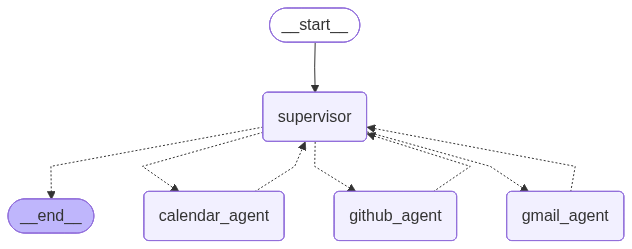

# Supervised Agent Workflow (Lecture 11)

In this project we will be creating a supervised agent workflow: a supervisor agent managing 3 subagents.

In our example our subagents will peform three distinct functions: 
- the `email_agent` will be checking incoming mails on our Gmail, writing drafts, requesting for approval or edits (HITL) and sanding emails if approved;
- the `calendar_agent` will check our Google Calendar, remind us of incoming events and writing new events if requested;
- the `github_agent` will check our `GitHub`notifications and, if we approve, dismiss them.

For details on MCP servers (used for the github agent) and handoff tools (used for the supervisor) refer to the [11_supervisor notebook](../../notebooks/11_supervisor.ipynb). 

    

