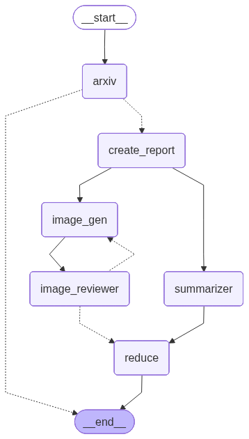
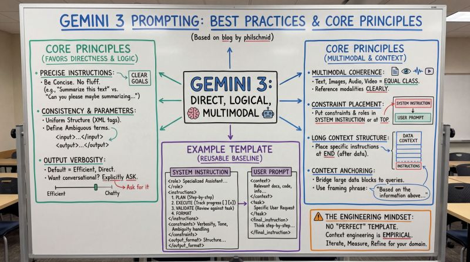

# Vision Agents

In this repo we will implement a multimodal agentic system. 

<center>
    
</center>

Specifically, we continue with the arvix agent we implemented in [voice agents/](../voice_agents/) to research for interesting papers on arxiv. 

Then, once a paper (a single one for simplicity) is selected, the system will produce a summary: both written and visual. For the latter, we use Gemini's NanoBanana model, which has been known to produce great "whiteboard summaries" (check example below).

After the image generation node, we have an image reviewer that checks the quality of the generated image. Since text summary and visual summary node run in parallel, we need a 'fan out' node (`create_report`) and a 'fan-in' node (`reduce`).

<center>
    
</center>

## Installation

```bash
pip install -e .
```

## Usage

```bash
python src/main.py
```

