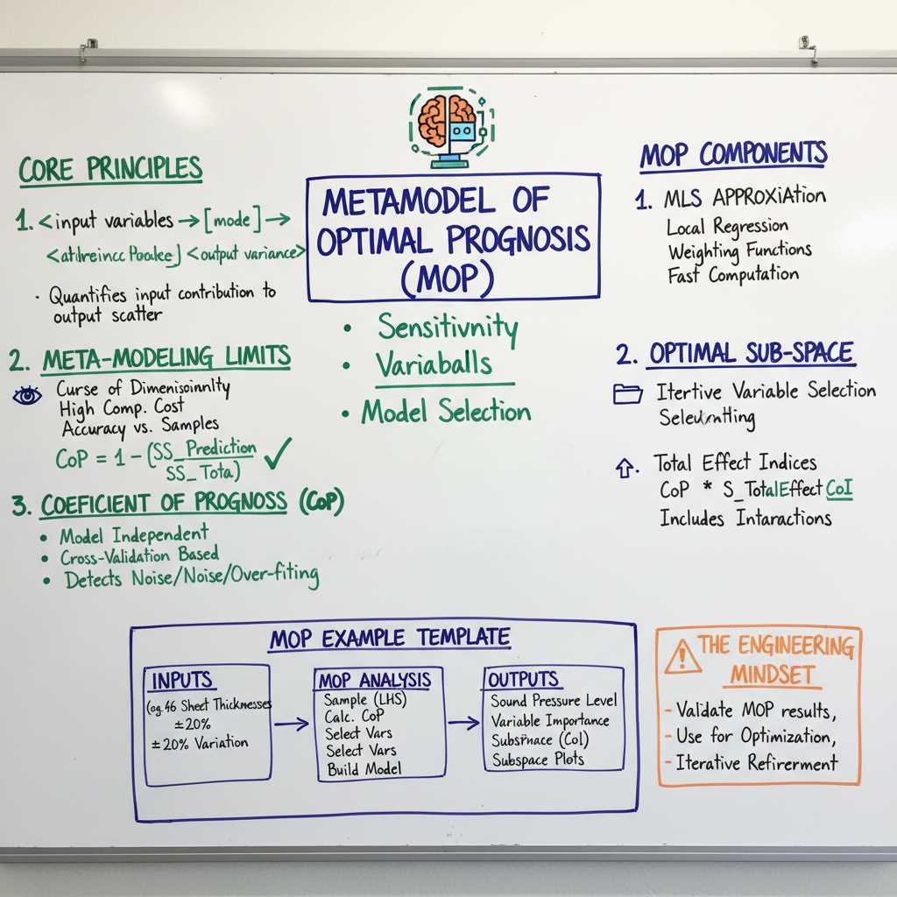

# Summary
**The Core Thesis**
This paper addresses the performance bottleneck in Graph Neural Networks (GNNs) caused by "over-smoothing," where node features become indistinguishable as network depth increases. The authors propose the Generalized PageRank (GPR) Graph Neural Network (GPRGNN), which decouples the feature extraction and propagation steps to allow for learned GPR weights. They claim this architecture effectively adapts to both homophilic (similar nodes connect) and heterophilic (dissimilar nodes connect) graphs, outperforming existing GNNs that are typically optimized for homophily.

**Methodology & Novelty**
GPRGNN diverges from standard Message Passing Neural Networks (MPNNs) by separating the neural network used for feature transformation (a standard MLP) from the graph convolution process. The novel contribution lies in the implementation of the Generalized PageRank scheme: $\mathbf{Z} = \sum_{k=0}^{K} \gamma_k \mathbf{\hat{A}}^k \mathbf{H}$, where $\gamma_k$ are learnable weights. Unlike APPNP, which uses a fixed teleport probability $\alpha$, GPRGNN learns the $\gamma_k$ coefficients via backpropagation. This allows the model to assign negative weights to certain neighborhood hops, which is theoretically proven to be essential for extracting information from heterophilic graphs. This decoupling ensures the model can handle any level of homophily without architectural changes.

**Primary Results (High-Density)**
The GPRGNN was benchmarked against 10 baseline models across 9 datasets (3 homophilic, 6 heterophilic). Key metrics include:
- **Homophilic Performance:** On the Cora dataset, GPRGNN achieved an accuracy of 83.85% (±0.66), comparable to or exceeding APPNP (83.31%) and GCN (81.5%).
- **Heterophilic Performance:** The performance gap was most significant on heterophilic datasets like Squirrel and Chameleon. On Squirrel, GPRGNN reached 50.04% (±1.44), significantly outperforming GCN (36.89%) and GAT (30.62%). On the Cornell dataset, GPRGNN achieved 91.35% (±1.89), surpassing the specialized H2GCN-1 (82.16%).
- **Weight Analysis (Fig. 1 & 3):** The authors demonstrate that for homophilic graphs (Cora), learned $\gamma_k$ values decay slowly, similar to a Personalized PageRank distribution. In contrast, for heterophilic graphs (Texas), the weights alternate between positive and negative values, effectively performing a high-pass filter operation to distinguish node differences from neighbors.
- **Robustness to Sparsity:** Experimental results on the Amazon-Computers dataset indicate that GPRGNN remains stable across varying training set sizes (2.5% to 60%), whereas models like GCNII show significant performance degradation in extreme low-data regimes.

**Limitations & Future Work**
The authors acknowledge that while GPRGNN is robust, the current implementation relies on a precomputed polynomial filter which may be computationally expensive for extremely large, dense graphs. The paper does not explore the integration of edge features or dynamic graph structures. Future research directions include optimizing the initialization of $\gamma_k$ to speed up convergence and extending the GPR framework to accommodate heterogenous graph types where different node classes might require different propagation weights. Additionally, the team notes that further theoretical refinement is needed to determine the optimal $K$ (propagation steps) for diverse graph topologies automatically.

