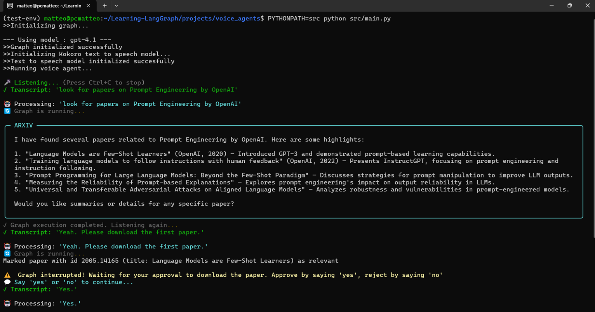

# Voice Agents

This subfolder implements a voice agent "the sandwich way", meaning that we implement a pipeline like:
```
TTS -> AGENT -> STT
```
Another common implementation is to use a whole voice agent alltogether, but we lose control over the different parts and usually we cannot use the most recent llms.

On the other hand, "the sandwich" leaves us with more liability and is less production ready. Needs more work. 

## Usage

Create a virtual environment for this project:

```bash
$ cd projects/voice_agents
```

```bash
$ conda create -n voice-agent python=3.11 -y
$ conda activate voice-agent
```

install requirements

```bash
$ pip install -r requirements.txt
```

Download `kokoro`'s models and voices (github reference: [Kokoro-onnx](https://github.com/thewh1teagle/kokoro-onnx/releases)):

```bash
$ wget -P ./src/TTS/models https://github.com/thewh1teagle/kokoro-onnx/releases/download/model-files/kokoro-v0_19.onnx
```

```bash
$ wget ./src/TTS/models https://github.com/thewh1teagle/kokoro-onnx/releases/download/model-files-v1.0/voices-v1.0.bin
```

rename the `.env.example` into `.env` and fill the OPENAI_API_KEY and the DEEPGRAM_API_KEY fields - get your DeepGram API key [here](https://console.deepgram.com/project/4461ac4c-3b39-4821-b312-85b1445b7b03).

You're ready to run the agent. From `projects/voice_agents`, run: 

```bash
$ PYTHONPATH=src python src/main.py
```
<center>
    
</center>

## Tech Stack (other than LangGraph)

* **[Deepgram Flux](https://deepgram.com/flux):** The first conversational Speech-to-Text (STT) model specifically designed for voice agents. Unlike standard transcription, Flux natively handles turn-taking, "barge-in" interruptions, and end-of-turn detection with ultra-low latency (~260ms), allowing for natural, fluid conversations.
* **[Kokoro](https://huggingface.co/hexgrad/Kokoro-82M):** An open-weights, 82M parameter Text-to-Speech (TTS) model. It provides state-of-the-art, human-like audio quality with subtle breathiness and prosody, while being lightweight enough to run locally. We use the onnx version.
* **[ONNX (Open Neural Network Exchange)](https://onnx.ai/):** An open standard for optimizing machine learning models. We use the ONNX version of Kokoro to enable faster-than-real-time inference on standard CPUs, removing the need for a dedicated GPU.